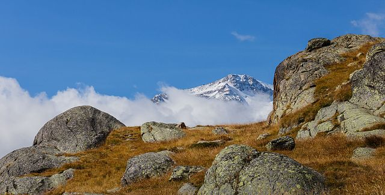
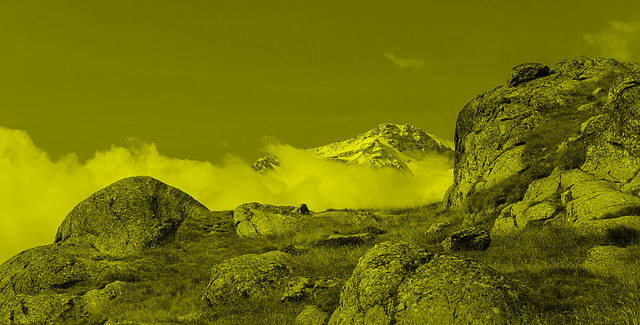
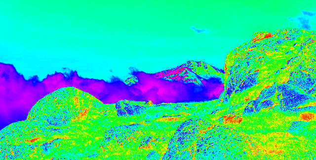
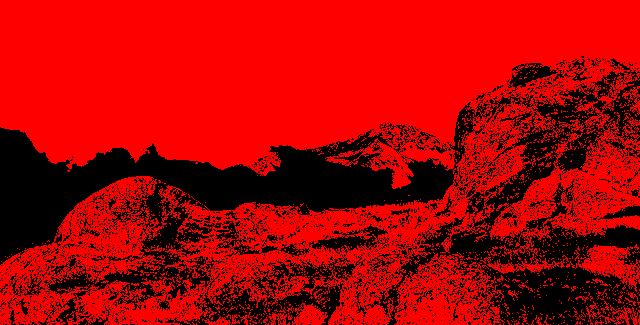

# ColorChanging

Small app for changing the appearance of an image in a glowing/colour changing way. See examples below.

## Background

The given input image will be converted to a grey-scale image. Then an iterative process is applied where
each grey value will be changed to a color in the given scale, e.g. rainbow scale 🏳️‍🌈. The iteration will move the 
color scale one step so that it will look like the color is fading.

All images will be collected to an output GIF-file.

## Examples

The image used is taken from [WikiCommons](https://commons.wikimedia.org/wiki/File:Bergtocht_van_parkeerplaats_bij_centrale_Malga_Mare_naar_Lago_Lungo._Uitzicht_op_Monte_Cevedale_07.jpg).



### Simple Scale

Here, a simple linear interpolation between black and yellow is used. Note that there is a hard step between yellow and black.



### Rainbow Scale

A uniform interpolation between the color red, yellow, green, cyan, blue, magenta and red is done. Note how the last color is the same as the first to achieve a smooth result.



### Almost Discreet Scale

```
 |-----------|-----------|-----------|-----------|-----------|----
0.000       0.3299     0.3301       0.6599      0.6601      1.0000
 black       black       red         red         black       black
```



